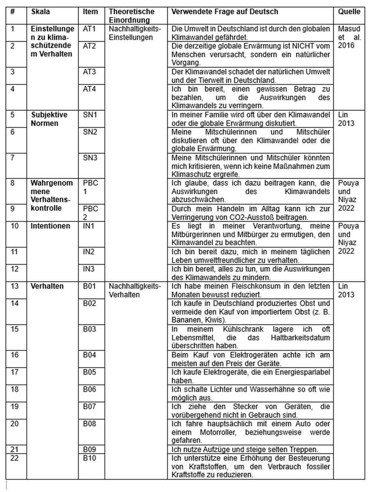
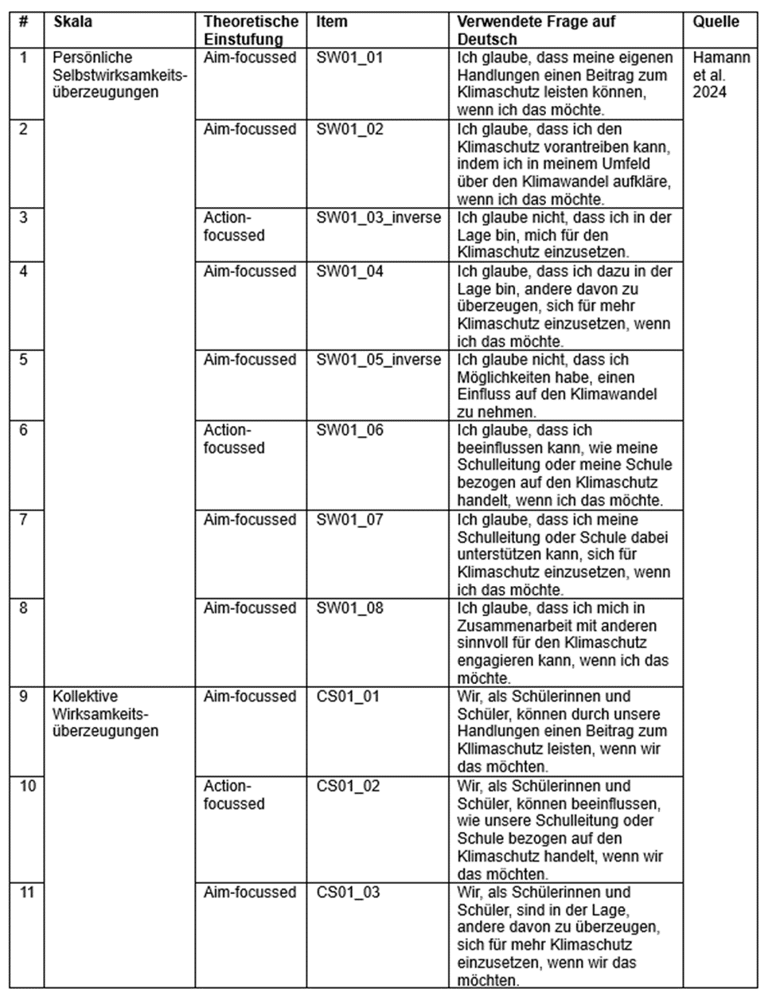
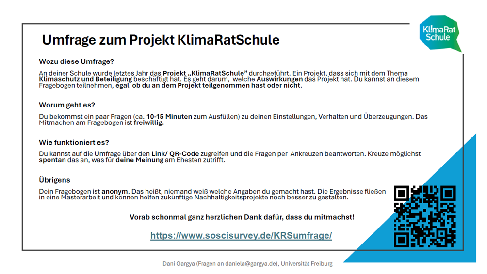

# Appendices

## Appendix A: German scales used
Table 7: The German scales used to measure sustainability attitudes and sustainability behaviours based on the Theory of Planned Behaviour. Attitudes, subjective norms, perceived behavioural control and intentions were combined to form sustainability attitudes, and self-reported behaviours were taken as sustainability behaviours. The scales have been copied one to one from Pauli (2023).
```{r table 7, echo=FALSE, out.width="80%"}

```

\newpage
Table 8: The German scales used for efficacy beliefs were based on the Triple-A framework (Agent-Action-Aim) by Hamann et al. (2024). The scales allow differentiation between personal and collective efficacy beliefs and between aim and action focus.
```{r table 8, echo=FALSE, out.width="85%"}

```

## Appendix B: Form Declaration of consent by parents
```{r b, echo=FALSE, out.width="85%"}

```


```{r einver, echo=FALSE, out.width="85%"}

```


## Appendix C: Information slide given to students at measurement point 3

```{r c, echo=FALSE, out.width="100%"}

```

## Appendix D: Statistical test results

Table 9: Kruskal-Wallis test results comparing scores across 3 measurement points within groups (RQ1).

```{r table 9,echo=FALSE, results='asis'}
# Read the Markdown table file and output its contents
cat(readLines("outputs/markdown_table_kruskal.md"), sep = '\n')
```


Table 10: Wilcoxon test results comparing groups (RQ1).

```{r table 10,echo=FALSE, results='asis'}
# Read the Markdown table file and output its contents
cat(readLines("outputs/markdown_table_wilcox_rq1.md"), sep = '\n')
```

Table 11: Wilcoxon test results comparing personal/collective efficacy within groups (RQ3).

```{r table 11,echo=FALSE, results='asis'}
# Read the Markdown table file and output its contents
cat(readLines("outputs/markdown_table_wilcox_rq3_sw_cs_within.md"), sep = '\n')
```

Table 12: Wilcoxon test results comparing personal/collective efficacy between groups (RQ3).

```{r table 12,echo=FALSE, results='asis'}
# Read the Markdown table file and output its contents
cat(readLines("outputs/markdown_table_wilcox_rq3_sw_cs_between.md"), sep = '\n')
```

Table 13: Wilcoxon test results comparing aim/action focused efficacy within groups (RQ3).

```{r table 13,echo=FALSE, results='asis'}
# Read the Markdown table file and output its contents
cat(readLines("outputs/markdown_table_wilcoxon_rq3_aim_action_within.md"), sep = '\n')
```

Table 14: Wilcoxon test results comparing aim/action focused efficacy between groups (RQ3).

```{r table 14,echo=FALSE, results='asis'}
# Read the Markdown table file and output its contents
cat(readLines("outputs/markdown_table_wilcox_rq3_aim_action_between.md"), sep = '\n')
```


## Appendix E: R Code

R Code, including outputs, can be accessed through GitHub 
https://github.com/DaniGargya/MEG_thesis.git.


\subsubsection*{Inital set-up}
```{r set up, eval = F}
# Data formating and cleaning for MA thesis MEG
# Dani Gargya
# June 24

# loading libraries ----
library(tidyverse)
library(ggplot2)
library(dplyr) 
library(haven) # to transform data from sav to csv
library(readr) # to transform data from sav to csv

# data conversion Lisas data from sav to csv ----
### import and convert lisas data from sav to csv
#pre angell
lisa_data_angell_pre <- read_sav("data/data_collection/data_pauli/ANGELL_PRE_anonym.SAV")
write_csv(x=lisa_data_angell_pre, path="data/data_collection/data_pauli/angell_pre.csv")

#post angell
lisa_data_angell_post <- read_sav("data/data_collection/data_pauli/ANGELL_POST_anonym.SAV")
write_csv(x=lisa_data_angell_post, path="data/data_collection/data_pauli/angell_post.csv")

## not needed
# pre goethe
#lisa_data_goethe_pre <- read_sav("data/data_collection/data_pauli/GOETHE_PRE_anonym.SAV")
#write_csv(x=lisa_data_goethe_pre, path="data/data_collection/data_pauli/goethe_pre.csv")

# goethe post
#lisa_data_goethe_post <- read_sav("data/data_collection/data_pauli/GOETHE_POST_anonym.SAV")
#write_csv(x=lisa_data_goethe_post, path="data/data_collection/data_pauli/goethe_post.csv")


# import new data and formating ----
## copied from scoscie website: GNU R-SCript für Daten-Import
ds_file = file.choose()
# setwd("./")
#ds_file = "rdata_KRSumfrage_2024-06-07_10-21.csv"
options(encoding = "UTF-8")
ds = read.delim(
  file=ds_file, encoding="UTF-8", fileEncoding="UTF-8",
  header = FALSE, sep = "\t", quote = "\"",
  dec = ".", row.names = NULL,
  col.names = c(
    "CASE","SERIAL","REF","QUESTNNR","MODE","STARTED","AT01_01","AT01_02","AT01_03",
    "AT01_04","B001_01","B001_02","B001_03","B001_04","B001_05","B001_06","B001_07",
    "B001_08","B001_09","B001_10","CS01_01","CS01_02","CS01_03","IN01_01","IN01_02",
    "IN01_03","PB01_01","PB01_02","SN01_01","SN01_02","SN01_03","SW01_01","SW01_02",
    "SW01_03","SW01_04","SW01_05","SW01_06","SW01_07","SW01_08","WD01","WD02",
    "WD02_01","WD02_02","WD02_03","TIME001","TIME002","TIME003","TIME004","TIME005",
    "TIME006","TIME007","TIME008","TIME009","TIME_SUM","MAILSENT","LASTDATA",
    "FINISHED","Q_VIEWER","LASTPAGE","MAXPAGE","MISSING","MISSREL","TIME_RSI"
  ),
  as.is = TRUE,
  colClasses = c(
    CASE="numeric", SERIAL="character", REF="character", QUESTNNR="character",
    MODE="factor", STARTED="character", AT01_01="numeric", AT01_02="numeric",
    AT01_03="numeric", AT01_04="numeric", B001_01="numeric", B001_02="numeric",
    B001_03="numeric", B001_04="numeric", B001_05="numeric", B001_06="numeric",
    B001_07="numeric", B001_08="numeric", B001_09="numeric", B001_10="numeric",
    CS01_01="numeric", CS01_02="numeric", CS01_03="numeric", IN01_01="numeric",
    IN01_02="numeric", IN01_03="numeric", PB01_01="numeric", PB01_02="numeric",
    SN01_01="numeric", SN01_02="numeric", SN01_03="numeric", SW01_01="numeric",
    SW01_02="numeric", SW01_03="numeric", SW01_04="numeric", SW01_05="numeric",
    SW01_06="numeric", SW01_07="numeric", SW01_08="numeric", WD01="numeric",
    WD02="numeric", WD02_01="logical", WD02_02="logical", WD02_03="logical",
    TIME001="integer", TIME002="integer", TIME003="integer", TIME004="integer",
    TIME005="integer", TIME006="integer", TIME007="integer", TIME008="integer",
    TIME009="integer", TIME_SUM="integer", MAILSENT="character",
    LASTDATA="character", FINISHED="logical", Q_VIEWER="logical",
    LASTPAGE="numeric", MAXPAGE="numeric", MISSING="numeric", MISSREL="numeric",
    TIME_RSI="numeric"
  ),
  skip = 1,
  check.names = TRUE, fill = TRUE,
  strip.white = FALSE, blank.lines.skip = TRUE,
  comment.char = "",
  na.strings = ""
)

row.names(ds) = ds$CASE

rm(ds_file)

#ds = ds_tmp
#rm(ds_tmp)

### assign groups ----
ds <- ds %>%
  mutate(Group = ifelse(WD02_01, "group2", ifelse(WD02_03, "group0", "group1")))

# count occurences
value_counts <- ds %>%
  count(Group)  # Count occurrences of each value in col1


# exclude incomplete data ----
# Remove unnecessary columns with NA
ds$SERIAL <- NULL
ds$REF <- NULL
ds$MAILSENT <- NULL

# Function to count the number of NAs in a row
count_nas <- function(row) {
  sum(is.na(row))
}

# Apply the function to each row and create a new column 'count_nas'
ds$count_nas <- apply(ds, 1, count_nas)

# Filter the data frame to exclude rows with NAs
ds_filtered <- ds[ds$count_nas <= 1, ]


# exclude data with more than 25% missing (8 answers) ----
###### more than 8 times I don't know or does it change because more questions??!
# Function to count the number of -1s in a row
count_minus_ones <- function(row) {
  sum(row == -1, na.rm = TRUE)
}

ds_filtered$count_minus_ones <- apply(ds_filtered, 1, count_minus_ones)

# Filter the data frame to exclude rows with more than eight -1s
ds_filtered <- ds_filtered[ds_filtered$count_minus_ones <= 8, ]

# exclude data with less than  2.5 min/ 150sec! processing time (instead of 4)----
#ds_filtered <- ds_filtered[ds_filtered$TIME_SUM >= 240, ]
ds_filtered <- ds_filtered[ds_filtered$TIME_SUM >= 150, ]


# data transformation # scaling according to Lisa (0-3, instead of 1-4) ----
# Define a function to convert values
convert_values <- function(x) {
  x <- ifelse(x == 4, 3,
              ifelse(x == 3, 2,
                     ifelse(x == 2, 1,
                            ifelse(x == 1, 0,
                                   ifelse(x == -1, -100, 
                                          x)))))
  return(x)
}


# Apply the function to all columns of the data frame
ds_scaled <- lapply(ds_filtered, convert_values)
ds_scaled <- as.data.frame(ds_scaled)

# invert certain scales to reflect meaning (AT2, B3, B4, B8, B9, SW3, SW5) ----
# Define a function to inverse scales
inverse_scale <- function(x) {
  x <- ifelse(x == 3, 0,
              ifelse(x == 2, 1,
                     ifelse(x == 1, 2,
                            ifelse(x == 0, 3, x))))
  return(x)
}

# Define a function to inverse scales and add new columns
inverse_scale_and_add_columns <- function(df, columns) {
  for (col in columns) {
    new_col_name <- paste(col, "inverse", sep = "_")
    df[[new_col_name]] <- inverse_scale(df[[col]])
  }
  return(df)
}


# Apply the function to add extra columns with inverse scales
ds_scaled_in <- inverse_scale_and_add_columns(ds_scaled, c("AT01_02", "B001_03", "B001_04", "B001_08", "B001_09", "SW01_03", "SW01_05"))

# save formated dataset as csv (angell_mzp3) ----
write_csv(x=ds_scaled_in, path="data/data_collection/angell_mzp3.csv")
```

\subsubsection*{Data Visualisation}
```{r data vis, eval = F}
# create colour palette ----
display.brewer.pal(n = 8, name = 'Dark2')
brewer.pal(n = 8, name = "Dark2")
display.brewer.pal(n=4, name = "Set1")
brewer.pal(n=4, name = "Set1")
taxa.palette <- c("#D95F02", "#7570B3", "#E7298A", "#E6AB02")
names(taxa.palette) <- levels(data1$TAXA)

# clean theme ----
theme_clean <- function(){
  theme_bw() +
    theme(axis.text.x = element_text(size = 14),
          axis.text.y = element_text(size = 14),
          axis.title.x = element_text(size = 14, face = "plain"),             
          axis.title.y = element_text(size = 14, face = "plain"),             
          panel.grid.major.x = element_blank(),                                          
          panel.grid.minor.x = element_blank(),
          panel.grid.minor.y = element_blank(),
          panel.grid.major.y = element_blank(),  
          plot.margin = unit(c(0.5, 0.5, 0.5, 0.5), units = , "cm"),
          plot.title = element_text(size = 15, vjust = 1, hjust = 0.5),
          legend.text = element_text(size = 12, face = "italic"),          
          legend.title = element_text(size = 12, face = "bold"),                              
          legend.position = c(0.2, 0.8))
}


#### panel time-series ----
# spatial distribution of time-series ----
(map_studies2 <- ggplot(bio_short,
                        aes(x = LONGITUDE, y = LATITUDE, 
                            colour = TAXA, size = NUMBER_OF_SAMPLES), alpha = I(0.7)) +
   borders("world", colour = "gray88", fill = "gray88", size = 0.3) +
   coord_cartesian(xlim = NULL, ylim = NULL, expand = TRUE) +
   theme_map() +
   geom_point(range = c(7,15)) +
   scale_size_continuous(range = c(3,10)) +
   guides(size = FALSE) +
   scale_colour_manual(values = taxa.palette) +
   scale_fill_manual(labels = c("Terrestrial plants",
                                "Birds",
                                "Mammals",
                                "Terrestrial invertebrates")) +
   labs(title = ("\n\n a) Spatial distribution of time-series\n")) +
   theme(legend.position= "bottom", 
         legend.title = element_blank(),
         legend.text = element_text(size = 14),
         legend.justification = "top",
         plot.title = element_text(size = 14, hjust = 0.5, face = "bold")))

ggsave(map_studies2, filename = "outputs/map_studies2.png",
       height = 5, width = 8)

# temporal distribution of biodiversity time-series ----
# making id variable as factor
bio_short$STUDY_ID_PLOT <- as.factor(as.character(bio_short$STUDY_ID_PLOT))

# create a sorting variable
bio_short$sort <- bio_short$TAXA
bio_short$sort <- factor(bio_short$sort, levels = c("Terrestrial plants",
                                                    "Birds",
                                                    "Mammals",
                                                    "Terrestrial invertebrates"),
                         labels = c(1,2,3,4))


bio_short$sort <- paste0(bio_short$sort, bio_short$START_YEAR)
bio_short$sort <- as.numeric(as.character(bio_short$sort))

(timeline_studies2 <- ggplot() +
    geom_linerange(data = bio_short, aes(ymin = START_YEAR, ymax = END_YEAR, 
                                         colour = TAXA,
                                         x = fct_reorder(STUDY_ID_PLOT, desc(sort))),
                   size = 1) +
    scale_colour_manual(values = taxa.palette) +
    labs(x = NULL, y = NULL,
         title = ("\n\n b) Temporal distribution of time-series\n")) +
    #theme_clean() +
    coord_flip() +
    guides(colour = F) +
    theme_bw() +
    theme(panel.grid.minor = element_blank(),
          panel.grid.major.y = element_blank(),
          panel.grid.major.x = element_line(),
          panel.border = element_blank(),
          panel.background = element_blank(),
          axis.ticks = element_blank(),
          legend.position = "bottom", 
          legend.title = element_blank(),
          axis.title.y = element_blank(),
          axis.text.y = element_blank(),
          axis.ticks.y = element_blank(),
          plot.title = element_text(size = 14, hjust = 0.5, face = "bold"),
          axis.text = element_text(size = 16), 
          axis.title = element_text(size = 20)))

ggsave(timeline_studies2, filename = "outputs/timeline_studies2.png",
       height = 5, width = 8)

# taxonomic distribution of biodiversity time-series ----
# calculating sample size for each taxa
taxa_sum <- bio_short %>%  group_by(TAXA) %>% tally

(taxa_studies2 <- ggplot(taxa_sum, aes(area = n, fill = TAXA, label = n,
                                       subgroup = TAXA)) +
    geom_treemap() +
    geom_treemap_subgroup_border(colour = "white", size = 1) +
    geom_treemap_text(colour = "white", place = "center", reflow = T) +
    scale_colour_manual(values = taxa.palette) +
    scale_fill_manual(values = taxa.palette) +
    labs(title = ("\n\n c) Taxonomic distribution of time-series\n")) +
    theme(plot.title = element_text(size = 14, hjust = 0.5, face = "bold")) +
    guides(fill= FALSE))

ggsave(taxa_studies2, filename = "outputs/taxa_studies2.png",
       height = 5, width = 8)

# panel ----
panel_b2 <- ggarrange(timeline_studies2, taxa_studies2, ncol = 2, align = c("h"))


panel_full2 <- grid.arrange(map_studies2, panel_b2, nrow = 2)

ggsave(panel_full2, filename ="outputs/panel_studies2.png",
       height = 10, width = 8)

#### RQ1: turnover ~ accessibility + duration ----
# prediction
pred_acc_d <- ggpredict(mo_tu_simp6, terms = c("scaleacc_25", "duration_plot"))

pred_acc_d$Monitoring <- factor(pred_acc_d$group, levels = c("6", "19.1", "32.2"),
                                labels = c("Short-term", "Moderate", "Long-term"))

# calculate change
pred_acc <- ggpredict(mo_tu_simp6, terms = c("scaleacc_25"))

# model vis
(graph_acc <- ggplot() +
    geom_line(data = pred_acc_d, aes(x = x, y = predicted, color = Monitoring),
              size = 2) +
    geom_ribbon(data = pred_acc_d, aes(ymin = conf.low, ymax = conf.high, 
                                       x = x, fill = Monitoring), alpha = 0.1) +
    geom_point(data = data1, aes(x = scaleacc_25, y = Jtu),
               alpha = 0.1, size = 2) +
    theme_clean() +
    scale_fill_manual(values = c("#7CFC00", "#66A61E", "#1B9E77")) +
    scale_colour_manual(values = c("#7CFC00", "#66A61E", "#1B9E77")) +
    labs(x = "\nAccessibility (proportion)", y = "Turnover\n") +
    theme(legend.position = c(0.2, 0.8)))

ggsave(graph_acc, file = "outputs/graph_acc.png", width = 7, height = 5)

(acc_d <- ggMarginal(graph_acc, type="density", size = 3, 
                     fill = "#666666", xparams = list(fill = "#A6761D")))

ggsave(acc_d, file = "outputs/graph_acc_den.png" , width = 7, height = 5)

#### RQ2: turnover ~ hpd ----
# prediction
pred_hpd <- ggpredict(mo_tu_simp6, terms = c("scalehpd_25"))

# model vis
(graph_hpd <- ggplot() +
    geom_line(data = pred_hpd, aes(x = x, y = predicted),
              size = 2, color = "#A6761D") +
    geom_ribbon(data = pred_hpd, aes(ymin = conf.low, ymax = conf.high, 
                                     x = x), fill = "#A6761D", alpha = 0.1) +
    geom_point(data = data1, aes(x = scalehpd_25, y = Jtu),
               alpha = 0.1, size = 2) +
    theme_clean() +
    labs(x = "\nHuman population density (proportion)", y = "Turnover\n") +
    theme(legend.position = c(0.85, 0.8)))

ggsave(graph_hpd, file = "outputs/graph_hpd.png", width = 7, height = 5)

(hpd_d <- ggMarginal(graph_hpd, type="density", size = 3, 
                     fill = "#666666", xparams = list(fill = "#A6761D")))

ggsave(hpd_d, file = "outputs/graph_hpd_den.png" , width = 7, height = 5)

#### RQ3: turnover ~ taxa ----
# raincloud plot
# by Ben Marwick
source("https://gist.githubusercontent.com/benmarwick/
       #2a1bb0133ff568cbe28d/raw/fb53bd97121f7f9ce947837ef1a4c65a73bffb3f/
       #geom_flat_violin.R")

# raincloud plot taxa jtu
(raincloud_taxa <- 
    ggplot(data = data1, 
           aes(x = reorder(TAXA, desc(Jtu)), y = Jtu, fill = TAXA)) +
    geom_flat_violin(position = position_nudge(x = 0.2, y = 0), alpha = 0.8) +
    geom_point(aes(y = Jtu, color = TAXA), 
               position = position_jitter(width = 0.15), size = 1, alpha = 0.1) +
    geom_boxplot(width = 0.2, outlier.shape = NA, alpha = 0.8) +
    labs(y = "\n Turnover", x = NULL) +
    guides(fill = FALSE, color = FALSE) +
    scale_y_continuous(limits = c(0, 1)) +
    scale_fill_manual(values = taxa.palette) +
    scale_colour_manual(values = taxa.palette) +
    coord_flip() +
    theme_clean())

ggsave(raincloud_taxa, filename = "outputs/raincloud_taxa_graph.png",
       height = 5, width = 8)

# effect size graph
pred_taxa <- ggpredict(mo_tu_simp6, terms = c("TAXA"))

(graph_taxa <- ggplot(pred_taxa, aes(x = reorder(x, desc(predicted)), 
                                     y = predicted, color = x)) +
    geom_point(aes(size = 1)) +
    geom_pointrange(aes(ymin = conf.low, ymax =  conf.high), size = 2) +
    scale_fill_manual(values = taxa.palette) +
    scale_colour_manual(values = taxa.palette) +
    theme_clean() +
    theme(legend.position = "none",
          axis.text.y=element_blank(),
          axis.title.y=element_blank()) +
    geom_hline(yintercept=0, linetype="dashed", size=1) +
    labs(x = NULL, y = "Effect size\n") +
    coord_flip())

ggsave(graph_taxa, filename = "outputs/taxa_model.png",
       height = 5, width = 5)

panel_taxa <- ggarrange(raincloud_taxa, graph_taxa, labels = c("A", "B"), ncol = 2)

ggsave(panel_taxa, filename ="outputs/panel_taxa3.png",
       height = 5, width = 8)

#### sensitivtiy analysis ----
# plants vs all ----
pred_plants <- ggpredict(mo_tu_simp_plants, terms = c("scaleacc_25"))
pred_all <- ggpredict(mo_tu_simp6, terms = c("scaleacc_25"))

data1_plants <- data1 %>% 
  filter(TAXA == "Terrestrial plants")

data1_nopl <- data1 %>% 
  filter(!TAXA == "Terrestrial plants")

(graph_plants <- ggplot() +
    geom_line(data = pred_plants, color = "#E6AB02", aes(x = x, y = predicted),
              size = 2) +
    geom_ribbon(data = pred_plants, color = "#E6AB02", aes(ymin = conf.low, 
                                                           ymax = conf.high, x = x), 
                alpha = 0.1, fill = "#E6AB02") +
    geom_point(data = data1_plants, color = "#E6AB02", aes(x = scaleacc_25, y = Jtu),
               alpha = 0.1, size = 2) +
    geom_line(data = pred_all, color = "#66A61E", aes(x = x, y = predicted),
              size = 2) +
    geom_ribbon(data = pred_all, color = "#66A61E", aes(ymin = conf.low, ymax = conf.high, 
                                                        x = x), alpha = 0.1, 
                fill = "#66A61E") +
    geom_point(data = data1_nopl, color = "#66A61E", aes(x = scaleacc_25, y = Jtu),
               alpha = 0.1, size = 2) +
    theme_clean() +
    labs(x = "\nAccessibility", y = "Turnover\n"))

ggsave(graph_plants, filename = "outputs/graph_plants.png",  height = 5, width = 8)

# scales ----
pred_1 <- ggpredict(mo_tu_simp8, terms = c("scaleacc_1"))
pred_25 <- ggpredict(mo_tu_simp6, terms = c("scaleacc_25"))
pred_50 <- ggpredict(mo_tu_simp7, terms = c("scaleacc_50"))
pred_100 <- ggpredict(mo_tu_scale100, terms = c("scaleacc_100"))

(graph_scale <- ggplot() +
    geom_line(data = pred_1, color = "#E41A1C", aes(x = x, y = predicted),
              size = 2) +
    geom_ribbon(data = pred_1, color = "#E41A1C", aes(ymin = conf.low, ymax = conf.high, 
                                                      x = x), alpha = 0.1, 
                fill = "#E41A1C") +
    geom_line(data = pred_25, color = "#377EB8" , aes(x = x, y = predicted),
              size = 2) +
    geom_ribbon(data = pred_25, color = "#377EB8" , aes(ymin = conf.low, ymax = conf.high, 
                                                        x = x), alpha = 0.1, 
                fill = "#377EB8" ) +
    geom_line(data = pred_50, color = "#4DAF4A" , aes(x = x, y = predicted),
              size = 2) +
    geom_ribbon(data = pred_50, color = "#4DAF4A", aes(ymin = conf.low, ymax = conf.high, 
                                                       x = x), alpha = 0.1, 
                fill = "#4DAF4A" ) +
    geom_line(data = pred_100, color = "#984EA3", aes(x = x, y = predicted),
              size = 2) +
    geom_ribbon(data = pred_100, color = "#984EA3", aes(ymin = conf.low, ymax = conf.high, 
                                                        x = x), alpha = 0.1, 
                fill = "#984EA3") +
    theme_clean() +
    labs(x = "\nAccessibility", y = "Turnover\n") +
    ylim(0, 1))

ggsave(graph_scale, filename = "outputs/graph_scale.png", height = 5, width = 8)
#### other additional graphs ----
# raincloud plot taxa accessibility ----
(raincloud_acc <- 
   ggplot(data = data1, 
          aes(x = reorder(TAXA, desc(scaleacc_25)), y = scaleacc_25, fill = TAXA)) +
   geom_flat_violin(position = position_nudge(x = 0.2, y = 0), alpha = 0.8) +
   geom_point(aes(y = scaleacc_25, color = TAXA), 
              position = position_jitter(width = 0.15), size = 1, alpha = 0.1) +
   geom_boxplot(width = 0.2, outlier.shape = NA, alpha = 0.8) +
   labs(y = "\nAccessibility (proportion)", x = NULL) +
   guides(fill = FALSE, color = FALSE) +
   scale_fill_manual(values = taxa.palette) +
   scale_colour_manual(values = taxa.palette) +
   coord_flip() +
   theme_clean())

ggsave(raincloud_acc, filename = "outputs/raincloud_taxa_acc_graph.png",
       height = 5, width = 8)

# protected areas ----
(graph_proteccted_areas <- ggplot() +
   geom_point(data = data1, aes(x = scaleacc_25, y = Jtu, colour = PROTECTED_AREA),
              alpha = 0.8, size = 1.5) +
   scale_colour_manual(values = c("#E6AB02", "#666666")) +
   theme_clean() +
   theme(legend.position = "none") +
   labs(x = "\nAccessibility", y = "Turnover\n"))

ggsave(graph_proteccted_areas, filename = "outputs/graph_protected_areas.png",
       height = 5, width = 8)

# graph duration and turnover ----
pred_duration <- ggpredict(mo_tu_simp6, terms = c("duration_plot"))

(graph_duration <- ggplot() +
    geom_line(data = pred_duration, aes(x = x, y = predicted),
              size = 2, color = "#666666") +
    geom_ribbon(data = pred_duration, aes(ymin = conf.low, ymax = conf.high, 
                                          x = x), fill = "#666666", alpha = 0.1) +
    theme_clean() +
    labs(x = "\nMonitoring duration (in years)", y = "Turnover\n") +
    ylim(0, 1))

ggsave(graph_duration, file = "outputs/graph_duration.png", width = 7, height = 5)

# histogram distribution of random and real values ----
# accessibility
bio_short <- bio %>% 
  distinct(STUDY_ID_PLOT, .keep_all = TRUE)

SP <- bio_short %>% 
  dplyr::select(LATITUDE, LONGITUDE, STUDY_ID_PLOT) %>% 
  distinct(LATITUDE, .keep_all = TRUE)

library(generator)
fake_lat <- r_latitudes(1023)
fake_long <- r_longitudes(1023)

fake_ll <- SP %>% 
  mutate(fake_lat = c(fake_lat),
         fake_long = c(fake_long)) %>% 
  dplyr::select(- LATITUDE, -LONGITUDE)

f_points <- cbind(fake_ll$fake_long, fake_ll$fake_lat)


f_sppoints <- SpatialPoints(f_points, proj4string=CRS('+proj=longlat +datum=WGS84'))
f_tp <- spTransform(f_sppoints, crs(aa))

f_e <- extract(aa, f_tp)

f_bio_aa <- cbind(fake_ll, f_e)
f_bio_aa_short <- na.omit(f_bio_aa)

# hpd
f_tp_hpd <- spTransform(f_sppoints, crs(hpd))

f_e_hpd <- extract(hpd, f_tp_hpd)

f_bio_hpd <- cbind(fake_ll, f_e_hpd)
f_bio_hpd_short <- na.omit(f_bio_hpd)

# figure overall
png("outputs/fake_ll.png", width=600, height=350)
par(
  mfrow=c(1,2),
  mar=c(4,4,1,0)
)
hist(f_bio_aa_short$f_e, col=rgb(1,0,0,0.5), xlab="Accessibility score", 
     ylab ="Number of points", main = "") # more normal distributed?
hist(data1$e, col=rgb(0,0,1,0.5), add=T)
hist(f_bio_hpd_short$f_e_hpd, col=rgb(1,0,0,0.5), xlab="Human population density score", 
     ylab ="Number of points", main = "")
hist(data1$e_hpd, col=rgb(0,0,1,0.5), add=T)
legend("topright", legend=c("Random","BioTIME"), col=c(rgb(1,0,0,0.5), 
                                                       rgb(0,0,1,0.5)), pt.cex=2, pch=15)
dev.off()

# histogram acc and hpd ----
png("outputs/hist_acc_hpd.png", width=600, height=350)
hist(data1$scaleacc_25, col = "#1B9E77", xlab="Accessibility/Human population density", 
     ylab ="Number of points", main = "")
hist(data1$scalehpd_25, col = "#A6761D", add =T)
legend("top", legend=c("Accessibility","Human population density"), 
       col=c("#1B9E77", "#A6761D"), pt.cex=2, pch=15)
dev.off()
```
