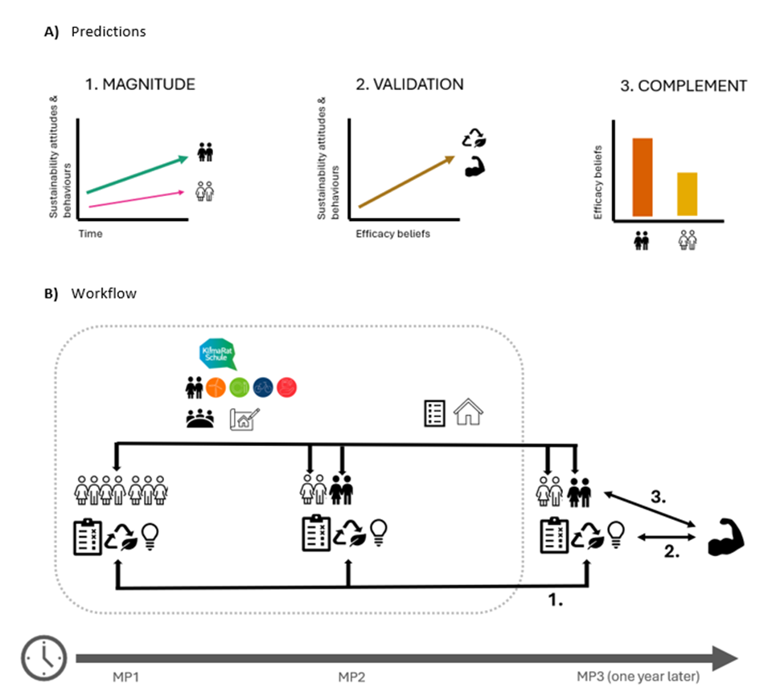

# Introduction
Globally, we as humankind are facing many ecological and social crises at the same time. Despite extensive and continuous efforts to transition to a more sustainable society, environmental and social challenges persist or have even worsened in various aspects (IPCC, 2023). In transition towards a more sustainable and just society, Education for Sustainable Development (ESD) is seen as a key aspect (BMBF, 2020). ESD is a holistic approach to education, that focuses on the development of sustainability competencies that enable the learners to contribute to sustainable development through their competencies of knowledge, skills, motivation, attitudes, and values (Rieckmann & Barth, 2022). Following the Brundtland Report and the Agenda 21 Conference in Rio, numerous programmes on Education for Sustainable Development have been initiated (Hoffmann, 2020). However, the relevance, impact, and effectiveness of ESD are often questioned (Ssossé et al., 2021). While ESD is widely accepted as a theoretical concept and goal dimension, it remains without an universally agreed upon definition. In addition, the complexity of the educational process makes it difficult to define outcomes and measure success accurately. Arguably, the effective development of ESD requires evidence-based recommendations, to make a real contribution for much needed changes in society. When looking at the empirical data on the impact and outcomes of ESD interventions in educational settings, there is very little. Disentangling the goals, methods and outcomes of ESD and establishing effective education without instrumentalising education is an urgent issue (Getzin & Singer-Brodowski, 2017; Ssossé et al., 2021). Currently, we have a limited quantitative understanding of how ESD interventions influence the development of sustainability competencies over time at the level of personal characteristics of learners, such as knowledge, skills, attitudes and values. Despite the call for a more comprehensive approach to measuring and operationalising ESD research, namely a shift from an input to an outcome orientation (Waltner et al., 2022), research has mostly focused on traditional learning methods  (Riess et al., 2022; Waltner et al., 2021) or on uncomprehensive study designs (Riess et al., 2022).  In this analysis, I focus on the implementation of ESD measures at school level. Although the students currently being educated in our schools are not the decision-makers of today, they will ultimately be the decision-makers of the future. Recent theoretical advances in sustainability competencies, such as the Triple A framework of efficacy beliefs (Hamann et al., 2024), together with the possibility of collecting long-term empirical data (Pauli, 2023) in a quasi-experimental design, allow us to quantitatively test the effects of innovative ESD interventions on students' sustainability competencies. The measurement of sustainability competencies linked to effective ESD education can provide the information and educational design guidance needed for better educational policy making in the light of our rapidly changing Anthropocene.

## Theoretical and conceptual context
Education for Sustainable Development (ESD) aims to empower individuals to contribute effectively to sustainable development by fostering critical engagement with societal complexities and contradictions (Rieß, 2011). This educational approach, endorsed by UNESCO (Rieckmann, 2021), is divided into two strands: ESD 1, an instrumental approach that promotes specific sustainable behaviours as defined by experts, and ESD 2, an emancipatory approach that equips learners with the tools to critically evaluate and identify sustainable practices themselves (Wals, 2012). While ESD 1 focuses on measurable changes in behaviour, ESD 2 emphasises the development of sustainability competencies necessary to navigate and influence complex, ambiguous issues. Both approaches can complement each other, especially in educational settings, where the behavioural focus of ESD 1 is justified by the shared educational and parental responsibilities in schools (KMK, 2023). For older learners, however, the focus should be on ESD 2 in order to cultivate critical thinking and autonomous action (Rieckmann, 2021). This shift is in line with the broader educational trend towards competency-based learning, which prioritises skills and abilities over specific content knowledge, thereby increasing the likelihood that students will internalise and apply sustainable practices (de Haan, 2006). ESD 2 approaches are even more complex to measure because of the issues surrounding the definition of relevant sustainability competencies to be measured. This complexity is evident in the ongoing debate on ESD and other transformative educational approaches (Getzin & Singer-Brodowski, 2017; Wals, 2006). ESD, as an intentional educational intervention, has the potential to challenge existing social, economic and political systems that perpetuate injustice and inequality, aligning it with critical pedagogy and interpretivist or constructivist epistemological paradigms (O’Flaherty & Liddy, 2018). While these paradigms would lend themselves well to mixed methods approaches, which allow for the existence of multiple realities and experiences that can be viewed differently (Moustakas, 1994) and complex, nuanced outcomes (Dumas & Anderson, 2014), much research is still based on predominantly positivist epistemologies, with quantitative measures such as pre/post surveys commonly used to evaluate educational interventions (O’Flaherty & Liddy, 2018). Due to resource constraints, I chose to adopt a purely quantitative approach, reflecting a positivist epistemology. There are many complex considerations that need to be taken into account when aiming to improve ESD - however, effective ESD interventions can benefit from being designed around measurable sustainability competencies and their continuous development.

### Goals of ESD
Sustainability competencies need targets against which they can be measured. While there may be project-specific objectives for each ESD intervention, the question remains as to the overarching understanding of the dimensions of the goals. At the international level, goals are set, for example, by Agenda 21 (UNCED, 1992). They provide a normative framework, but there is no operationalisation of ESD outcomes (Wiek et al., 2011). At the local level, there are regional education plans, such as the one in Baden-Württemberg, Germany: "Education for Sustainable Development enables learners to make informed decisions and act responsibly for the protection of the environment, a functioning economy and a just world society for current and future generations"  (Ministry of Education Baden Württemberg, 2016), but they also remain without operationalisation. Educational goals, which are personal characteristics to be promoted in learners, should include a normative test and an empirical test. Critical analyses of major ESD goal recommendations suggest that sustainability competencies encompass the cognitive abilities, skills, and the related motivational, volitional, and social preparedness necessary for addressing sustainability-related challenges and promoting sustainable development in personal, social, and institutional contexts (Rieß et al., 2018). Although some ESD learning goals exist, there is still a lack of operationalisation of ESD outcomes to be translated into measurement models and tools (Rieß et al., 2018). The use of empirically validated measurement tools and approaches from related disciplines makes it possible to integrate operationalised facets of competencies in the context of ESD. As such, ESD learning goals need to be structured and interrelated. One prominent framework is the tripartite framework model for sustainability competencies (Rieß et al., 2018), which includes cognitive, affective motivational (= attitudinal), and behavioural related to sustainability. The cognitive dimension of sustainability competencies ranges from knowledge of basic concepts of sustainable development and the SDGs to an understanding of physical, ecological, social, cultural, economic and political systems related to sustainability. The attitudinal dimension includes values, needs and motivational competencies, such as acceptance of intergenerational equity and attitudes towards consumption and mobility. The behavioural dimension includes promoting sustainable practices and helping learners to translate their understanding into concrete actions. The framework has the advantages of including the behavioural dimensions (Lambrechts et al., 2013), being adaptable to different contexts (Waltner et al., 2019), and countering criticism of the dominance of the cognitive dimensions (Rieckmann & Barth, 2016). If the aim is to measure sustainability competencies, it is useful to benchmark against the specific goal dimensions of sustainability knowledge, sustainability behaviour (SB) and sustainability attitudes (SA).

### Operationalisation of ESD outcomes
There have been numerous attempts to operationalise the measurement of sustainability competencies through the use of survey scales. For empirical measurement, these competencies need to be precisely defined (Klieme & Hartig, 2008). Despite existing efforts, there is still a need to develop adequate measurement instruments for the different dimensions of sustainability competencies (SC). Integrating ESD research with well-established measurement approaches facilitates the inclusion of already operationalised facets (e.g. environmental attitudes) in the broader construct of SC. Examples of measurement approaches exist in related disciplines for each of the three target dimensions. For the cognitive dimension, tools are available to assess specific aspects of sustainability knowledge (e.g., environmental knowledge (Frick et al., 2004)). For the attitudinal domain, tools such as the Greenpeace Sustainability Barometer (Grunenberg et al., 2012) are used, and for the behavioural dimension, the General Ecological Behaviour Scale (Kaiser et al., 2001) is a notable example. Recent research has attempted to combine these scales and adapt them to the school context (Waltner et al., 2021). At the same time, it remains uncertain as to what extent indicators can capture the ultimate normative goal of ESD: the actual development of a more sustainable society through sustainable behaviour. Theories of action in psychology suggest that various forms of knowledge and motivational factors (including subjective and social norms and attributions of responsibility) interact to form behavioural intentions, which then lead to sustainability-relevant behaviour (Ajzen, 1991). In addition, external conditions (e.g. behavioural opportunities, situational contexts, social norms and the lifestyle of the social environment) also influence sustainability-relevant behaviour. Promoting knowledge and motivational orientations can therefore encourage desired behaviours. However, research has consistently shown a significant gap between knowledge, motivational orientations and actual sustainability-promoting behaviour  (Kollmuss & Agyeman, 2002; Terlau & Hirsch, 2015). Specifically, in the cognitive goal dimension, sustainability knowledge is positively related to sustainability attitudes (Arcury, 1990), but the prediction of actual behaviour is quite low (Frick et al., 2004). Knowledge serves as an indirect predictor of behaviour, providing a foundation but lacking the necessary motivational factors. This often-cited gap between knowledge and behaviour is evident in several studies and should be explored further (Kagawa, 2007). For the affective-motivational and behavioural dimensions, numerous studies have shown a very close relationship. Affective goal commitment, or a positively valued sequence of actions, is central to motivation. An action will not be performed if the perceived costs outweigh the affective goal commitment. The attitude-cost relationship is modelled in the Campbell paradigm  (Kaiser et al., 2010), which suggests a strong link between an individual's attitudes and behaviour. Consequently, within the Campbell paradigm, behavioural self-reports are used as indicators of a person's attitudes. When operationalising the sustainability competencies that are most relevant to real-world behaviour, it is most effective to use scales that capture sustainability attitudes and sustainability behaviours.

The operationalisation of behavioural sustainability competencies can benefit from exploring the underlying theories of behaviour. Empirically, some of the most commonly used models of sustainability-relevant behaviour are the Theory of Planned Behaviour (TPB) and the Norm Activation Model (Bamberg & Möser, 2007) .The TPB is one of the most prominent from-within approaches (Ertz et al., 2016). The from-within approach focuses on individual decision making. As this approach is more accessible to education, it will be pursued further in this paper. In the TPB, intention and perceived behavioural control (PBC) are seen as direct determinants of behaviour (Ajzen, 1991). Intention, in turn, is influenced by PBC, but also by two other factors: firstly, attitudes towards the behaviour in question, and secondly, subjective norms that influence behavioural intention. Behind these determinants are beliefs or convictions that relate to behaviour, norms and control (Ajzen, 1991). The TPB, as a rational choice theory, focuses on the self-interest of the person weighing the consequences of their actions (Kaiser et al., 2005). Research assessed the explanatory power of the TPB for pro-environmental behaviour. According to their study, the three determinants - attitude, subjective norms and perceived behavioural control - explain 76% of the variance in behavioural intention, while these in turn explain 95% of the variance in an individual's pro-environmental behaviour (Kaiser et al., 2005) . However, in a meta-analysis, this average was significantly lower at 27% variance explanation (Armitage & Conner, 2001). On the downside, the directions of effect between attitudes, subjective norms and perceived behavioural control remain incompletely identified in the TPB (Kaiser et al., 2005). Furthermore, it has been criticised for focusing on internal factors such as knowledge and attitudes and for failing to consider structural barriers, power relations and inequalities that pose systemic barriers to individuals (Bamberg et al., 2021), as well as moral and normative considerations (Kaiser et al., 2005). For operationalisation in the context of this study, the TPB was used due to existing data. Attitudes and subjective norms can be assigned to the affective dimensions, while PBC and intentions represent motivational aspects. These four variables at the first and second causal levels are summarised here as sustainability attitude dimensions, alongside the sustainability behaviour dimension, which is derived directly from self-reported behaviour. Therefore, sustainability competencies and the sustainability attitude and sustainability behaviour dimensions can be operationalised with the components of the Theory of Planned Behaviour.

### Measurement approaches
The operationalisation of sustainability competencies and their attribution to an ESD intervention can be assessed using different methods. Quantitative research projects can make a significant contribution to the normative debate by providing empirical insights and a valuable information base for ESD stakeholders, including teachers (Waltner et al., 2019). It is important not to rely solely on plausible and normative considerations and assumptions. Some effects of educational measures, such as teaching or the whole institutional approach, may only be empirically verifiable in the long term, or may not be clearly attributable to a specific measure due to the complexity of interacting variables that influence, for example, sustainability awareness. These considerations highlight that shifting the focus from input to output orientation of ESD policies may require longer-term assessments and different methodological approaches to effectively assess impacts (Waltner et al., 2022). At present, empirical data on the long- and short-term impacts of ESD initiatives in educational settings are limited (Riess et al., 2022), indicating the need for further research and comprehensive evaluation strategies. The measurement of sustainability competencies benefits from looking at long-term empirical data.

When measuring sustainability competencies, the choice of measurement method also depends on the teaching and learning approach used. There is a strong call for alternative and innovative approaches to ESD (Tejedor et al., 2019). Fostering personal attributes with high affective-motivational components, such as attitudes towards sustainable development and intergenerational equity, requires methods that effectively address complex human characteristics. Despite the inherent stability and resistance to change of attitudes, the integration of principles from general motivation and social psychology may prove beneficial (Deci & Ryan, 2008). Techniques such as inducing cognitive conflict, role-playing, simulation games and experiential learning activities, including sustainability projects and internships, have shown potential to increase motivation and change attitudes (Riess et al., 2022). These methods facilitate a deeper engagement with different perspectives and arguments, which is essential for promoting sustainable behaviour. In addition, supporting students' intrinsic motivation by providing experiences of competence, autonomy and social connectedness - such as choosing between different types of food in a school canteen and participating in group learning - can significantly enhance the effectiveness of these educational strategies (Deci & Ryan, 2008). Promoting sustainable behaviour requires a multifaceted approach that addresses both internal and external factors that influence individual actions. Psychological theories of action suggest that a mix of knowledge, motivational factors, subjective and social norms, and attributions of responsibility can lead to the formation of behavioural intentions and ultimately drive actual behaviour (Ajzen, 1991). However, despite the availability of knowledge and motivational orientations, there is often a significant gap between these elements and the manifestation of behaviour that promotes sustainability. To bridge this gap, methods from volitional psychology are recommended. These methods include making individuals aware of and challenging their guiding assumptions and beliefs, forming concrete action plans, encouraging self-commitment, visualising the results of actions and using reminders (Rieß, 2011). In educational settings, teachers play a crucial role in promoting behaviour change by raising awareness of students' subjective theories and fostering efficacy, thereby enabling students to see the impact of their actions and motivating them to commit to sustainable practices (Riess et al., 2022). However, the availability of empirical data is limited to certain types of ESD learning/teaching methods. The call for alternative and innovative methods of delivering ESD is not empirically supported (Riess et al., 2022). To date, innovative ESD intervention studies mostly include results in the form of self-reports, self-assessments and expert surveys (Riess et al., 2022), which are non-experimental research methods. In contrast, quasi-experimental studies can be used to test hypotheses and provide evidence of the effectiveness of methods. To date, these robust scientific methods have mainly been applied to ESD intervention methods with a high degree of teacher guidance. In addition, the validity of quasi-experiments can be enhanced with experimental controls (e.g. pre-post or control group test design) (Handley et al., 2018). Due to the lack of empirical data, it is not yet possible to make conclusive statements about the 'best' teaching/learning methods, although there are recommendations from empirical education and teaching research. Given the mismatch between evidence-based learning recommendations and the availability of comprehensive research design methods, there is a need to measure innovative ESD methods using quasi-experimental designs.

The measurement of sustainability competencies requires validity criteria to ensure that the measurement tools accurately capture the achievement of the objectives - in this case, the competencies that enable learners (among others) to contribute to real-world change. Ideally, one would obtain observational data to see if actual behaviour has changed. In reality, self-reports are more commonly used as they are easier to obtain, especially in large numbers, and also allow for a broader assessment of different behaviours (Kaiser et al., 2001). The challenge is that there is a gap between self-reported and objective behaviour. To overcome this, measurement indicators need to be validated with real behavioural outcomes. One reason for this gap could be the tendency of respondents to give socially desirable answers (Waltner et al., 2019). There are several ways to carry out scale validation. One option would be to perform an ad hoc scale validation, comparing the items used in this study with well-established measures that have been tested for their predictive power of real-life behaviour. Another option would be to validate against a criterion outside of the measurement process that is considered a valid proxy for actual behaviour and is assessed using a simple dichotomous approach (Kaiser et al., 2003; Kormos & Gifford, 2014). The newly developed Triple A framework of efficacy beliefs complements the TPB-based scales in terms of its predictive power for behaviour and behavioural intentions (Hamann et al., 2024). One study found that the TPB could benefit from incorporating aspects of the Triple A framework to increase its explanatory power (Bamberg & Rees, 2017). The Triple A framework, with its high degree of differentiation, expands the possibility of assessing different behavioural outcomes (Hamann et al., 2024). Therefore, an interesting option is to compare the TPB-based scale with one based on efficacy beliefs. Administering both a TPB-based scale and one based on efficacy beliefs provides an opportunity to validate each scale against the other, thus ensuring a higher quality of measurement.

### The potential role of efficacy beliefs in sustainability competencies
Measuring sustainability competencies can benefit from a high degree of differentiation based on the new theoretical development of the Triple-A framework of efficacy beliefs. The Triple-A framework provides a structured approach to enhance the somewhat fragmented field of efficacy research, particularly in the context of collective social and environmental goals (Hamann et al., 2024). This framework is essential for addressing social and environmental crises more effectively by understanding how individuals and collectives can experience greater efficacy. The framework builds on foundational theories of efficacy (Bandura, 1978; Skinner, 1991), and is structured around three core components - agents, actions, and aims. The self-categorised agent can be an individual (personal self) or a collective group (an ingroup), where the group is part of an individual's self-concept influenced by social and emotional group membership. This distinction allows for the exploration of both personal and collective efficacy. Individuals can move flexibly from categorising themselves as individuals to members of groups (Cocking & Drury, 2004), reflecting different underlying social identities. The agentic aspect signals the possibility of being able to effect change. The second aspect of the framework, intentional action, emphasises that efficacy involves deliberate, measurable actions aimed at achieving specific outcomes. These actions are defined not only by their intentionality, but also by their self-determined nature, level of abstraction and content. This component emphasises the proactive nature of efficacy in influencing and changing environmental and social conditions (Hamann et al., 2024). Finally, the Triple-A framework focuses on aims, which are cognitive representations of desired outcomes, whether personal or collective. Aims are essential because they focus attention, motivate, and promote persistence and skill development (Locke & Latham, 2002). The framework emphasises the bidirectional influence between efficacy and aims, with perceptions of efficacy influencing the choice of aims and, conversely, the nature of those aims influencing the development and maintenance of efficacy beliefs. This also highlights the importance of aim desirability. Overall, the Triple-A framework not only clarifies the structure of efficacy beliefs, but also enriches theoretical discourse by distinguishing the three efficacy links (agent-action, agent-action-aim, agent-aim) and explicitly applying them to both personal and collective contexts (Hamann et al., 2024). This approach promises to advance the practical application of efficacy theory in addressing broader social and environmental challenges by emphasising the interconnectedness of beliefs, actions, and aims in achieving sustainable change. Given the advantages of the efficacy framework, it represents an interesting complement to the measurement of sustainability competencies.

Sustainability competencies do not only depend on the individual. As early as 1997, Albert Bandura described a collective sense of powerlessness in an increasingly interdependent world and argued that in the face of multiple crises, there is a growing need for collective as well as individual action (Bandura, 1997). Many people do not act collectively against climate change or social inequality because they feel that they or their group cannot make a difference. Understanding how people come to feel that they can make a difference (a sense of efficacy) is therefore crucial to motivating people to act together for a better world (Hamann et al., 2024). The nature of the environmental and social crisis also requires collective action. Correlational studies have found that personal efficacy predicts individual behaviour and collective efficacy predicts activist behaviour (Hamann & Reese, 2020). Although the pathways and linkages between personal and collective efficacy beliefs are not yet fully understood, research can contribute to practical interventions based on this distinction. Some research suggests a pathway from collective to personal efficacy to private behaviour (Jugert et al., 2016), although this is not yet causally replicable. Experimental studies suggest that ingroup efficacy interventions outperform personal efficacy interventions in influencing behaviour (Jugert et al., 2016). Research could focus on which ingroup efficacy agents are more or less important in specific social and environmental crises, drawing on social identity theory (Tajfel, 1978), which characterises different ingroup efficacy agents. Collective efficacy has been found to be a better predictor of pro-environmental behaviour than personal efficacy (Chen, 2015). Furthermore, specific collective and personal efficacy perceptions have been used to measure sustainable intentions, even when controlling for attitudes and social norms, suggesting that collective efficacy beliefs are particularly relevant for achieving environmental goals (Reese & Junge, 2017). Measuring sustainability competencies may benefit from including efficacy beliefs as an outcome target at both the personal and collective levels.

Sustainability competencies are not only dependent on internal factors. The distinction between action- and aim-focused efficacy beliefs is interesting and relevant because it provides a clearer understanding of how beliefs about personal and collective capabilities translate into behaviour and goal attainment. Changes in sustainability competencies, particularly efficacy beliefs, are dependent on feedback from the environment. The Triple-A framework allows for a distinction between action and aim-focused efficacy linkages, with agent-action efficacy more closely linked to actual behavioural costs, socio-economic circumstances and impactful behaviours, whereas agent-aim efficacy is more closely linked to attitudes, goals, visions and intentional behaviours (Bain et al., 2013; Bamberg & Rees, 2015). Perceived behavioural control in the theory of planned behaviour (Ajzen, 1991) predicts intention and moderates intention-outcome relationships, suggesting that action-focused efficacy may function similarly by capturing constraints such as time, money, or social resources that may prevent the implementation of intentions. In contrast, aim-focused efficacy is more involved in intention formation and less influenced by these constraints. The field of collective social and environmental aims is particularly prone to an aim-focused understanding of efficacy due to the complex nature of collective crises(van Zomeren et al., 2019). For collective aims, the challenge is not in performing actions (e.g., going to a protest), but in achieving social change through these actions. Given that many actions to achieve an environmental or social aim are possible, but also potentially unsuccessful, acknowledging the looser action-aim contingencies highlights the importance of distinguishing between action- and aim-focused efficacy (Hamann et al., 2024). Individuals have limited control over collective outcomes, with many obstacles stemming from external factors and the actions of others (Hornsey et al., 2022). Feedback is more difficult to obtain, as aims are often distal (for example, the impact of an awareness campaign on public opinion). Hornsey et al. (2006) found that efficacy predicted action intentions differently for members and non-members of protest groups depending on the content of the aim. Studies that have included different aims in their efficacy measures have shown that ignoring aim content can lead to inconsistent results and obscure underlying principles (Koletsou & Mancy, 2011). The desirability of an aim is crucial; if an aim is not desirable, efficacy measures may elicit defensiveness and reflect only the value of the aim (Castiglione, 2020). The relationship between action-focused and aim-focused efficacy is complex and interdependent. Action-focused efficacy refers to beliefs in one's ability to perform specific actions, whereas aim-focused efficacy refers to beliefs in one's ability to achieve desired outcomes. These two facets are interrelated; effective action often leads to aim attainment, and belief in aim attainment can motivate individuals to take necessary action (Hamann et al., 2024). The Triple-A framework integrates these concepts, suggesting that efficacy beliefs should consider both actions and aims to provide a comprehensive understanding of how individuals and groups approach and solve complex social and environmental problems. Measuring changes in sustainability competencies at both the action and aim levels allows for a better understanding of the influence of external and structural factors on behaviour.

## Objectives and research questions
My aim is to quantify how ESD interventions influence students' sustainability competencies. Specifically, I will focus on sustainability competencies, operationalised as sustainability attitudes and sustainability behaviours, measured by scales based on the Theory of Planned Behaviour. In addition, I will assess efficacy beliefs through scales operationalised based on the newly developed Triple A framework.  To achieve this, I will investigate the influence of an innovative ESD intervention in one school, in a quasi-experimental longitudinal study with a treatment group control group comparison, by analysing 206 self-reported surveys from three different measurement points, addressing the following research questions (RQ):

1. How do students' sustainability attitudes and sustainability behaviours change over time (including one year after the end of an ESD intervention)?

2. How are sustainability attitudes and sustainability behaviours influenced by efficacy beliefs?

3. How do (personal and collective) efficacy beliefs (aim- and action-focussed) respond to the level of student involvement?

## Research hypotheses and predictions
I hypothesize that sustainability attitudes and sustainability behaviours will increase over time. The magnitude of sustainability competency gains increases for the involved group. When looking at the relationship between sustainability attitudes/ sustainability behaviours and efficacy beliefs, I hypothesize a strong correlation. I hypothesize that efficacy beliefs will vary within and between the involved and control group, in terms of personal and collective, and aim- and action-focussed efficacy beliefs. These hypotheses will be tested against the null hypotheses of no increase in SA and SB over time, no relationship between SA/SB and efficacy beliefs, and no differences in efficacy beliefs within and between groups. 

I predict higher SA and SB for the involved students, as innovative learning methods seem promising to achieve SA and SB. I predict the relationship between SA/SB and efficacy beliefs to be strong, as they capture the same latent construct. I predict higher collective and aim-focussed efficacy beliefs for the involved group, as they differ in the mastery experience and therefore in their learning (Figure 1). 
If I find support for my null hypotheses, it will indicate that the scales used cannot adequately capture the sustainability competencies resulting from an innovative ESD intervention, but also question whether the current approaches to ESD interventions are adequate. If the results are in line with my alternative hypotheses, this will demonstrate the importance of innovative ESD interventions in fostering human agency.

```{r conceptual diagram, echo=F, fig.cap="\\label{fig:fig1} Influence of an innovative ESD intervention on long-term changes in sustainability competencies. I analysed how an innovative ESD intervention can influence the sustainability attitudes, sustainability behaviours, and efficacy beliefs of high school students at three different measurement points (MPs) of the intervention: pre-intervention (MP1), immediately post-intervention (MP2) and one year post-intervention (MP3), comparing an involved group with a control group. \\textbf{A} Conceptual diagrams of my predictions, outlined in terms of sustainability attitudes, sustainability behaviours, and efficacy beliefs. \\textbf{B} Analytical Workflow.",out.width = '90%',fig.show='hold',fig.pos="H", fig.align='center'}

```