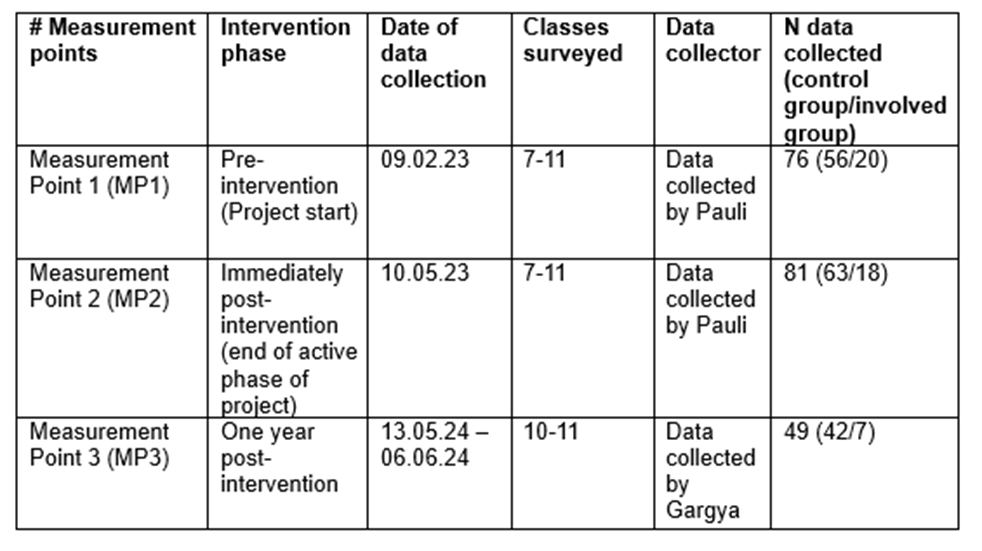
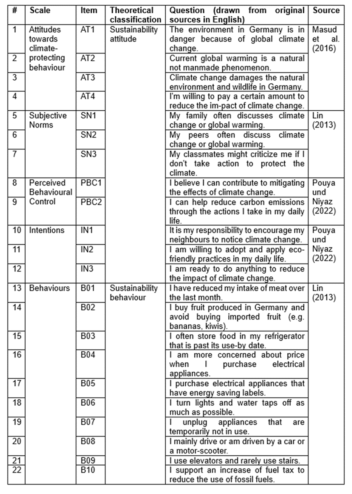
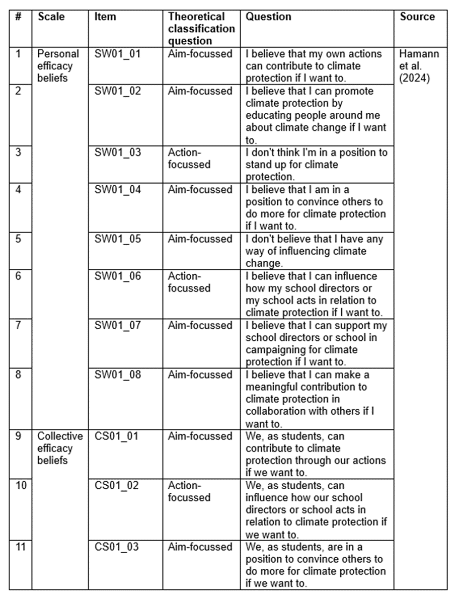
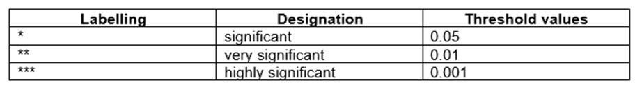
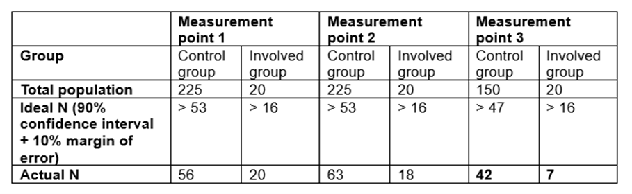
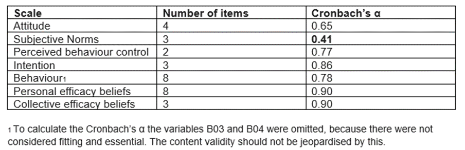

# Methods

In this study, I analysed how an innovative ESD intervention influenced students' sustainability attitudes, sustainability behaviours and efficacy beliefs as components of sustainability competencies over time. To quantitatively test the effect of the ESD intervention, I assessed long-term effects by measuring data at three different measurement points (pre-intervention, immediately post-intervention and one year post-intervention) using the same self-reported survey on sustainability behaviours and sustainability attitudes. I also complemented the data collection with a survey on efficacy beliefs at the third measurement point. I used the data collected by Pauli (2023) for measurement points one and two. In total, I analysed 206 self-reported surveys.

## Project description KlimaRatSchule
To analyse changes in sustainability competencies over time, I chose the ESD intervention KlimaRatSchule (KRS). The KRS project aims to promote and establish an active climate protection culture in schools through democratic participation processes. Students investigate the carbon footprint of their own school and carry out a democratic participation process, the results of which are used to develop the school's own climate protection concept (KRS website, 2024). The project was piloted in two schools in Freiburg in January 2023. The project was designed by Solare Zukunft e.V., IZT, Energie- und Umweltzentrum am Deister e.V. and Green City e.V.. The project can be divided into 3 phases: in the first phase, a group of volunteers (involved group) was formed and collected data on the school's emissions. In the second phase, a micro-citizen report for schools was conducted with randomly selected students from the school, and in the third phase, the project partners developed a roadmap with concrete goals and steps for the school to reduce its carbon footprint based on the students' work in phases one and two  (KRS website, 2024).  Although the project included the very interesting aspect of participation, unfortunately, due to severe data limitations, the group that was part of the micro-citizen report had to be excluded from the analysis and therefore the analysis of the participatory aspect of the project also had to be excluded. The ESD intervention aimed to achieve a real impact in terms of CO2 emission reduction, while at the same time achieving climate and democratic education.

The ESD intervention can be classified as follows in terms of learning and teaching methods and procedures. The involved group (= treatment group) was voluntarily participating in the group. They assessed different dimensions of the school's CO2 emissions in a self-regulated and self-directed manner. They applied their knowledge and problem-solving skills in a real-world, group-based, solution-oriented environment (KRS website, 2024). Considering all these learning methods and procedures, this ESD intervention can be considered as an innovative ESD intervention (as opposed to more traditional teaching-learning formats) (Riess et al., 2022). 

## Study design and data collection
The research was designed as an empirical, long-term, quasi-experimental study. To collect the data, a digital survey was created that mapped the constructs of the Theory of Planned Behaviour, which was the same as that used by Pauli (2023) for the first two measurement points. Accordingly, attitudes, subjective norms, perceived behavioural control, intentions and behaviours with regard to climate protection were measured. In addition, the survey was complemented by a scale measuring efficacy construct based on the Triple A framework. Accordingly, personal and collective efficacy beliefs as well as action and aim-focused efficacy beliefs were assessed.

The survey was conducted at a secondary school in the Freiburg area, the ANGELL school, a Montessori centre in the city, which is state-recognised and run as an independent non-profit organisation. Following a quasi-experimental design, two comparison groups were formed for the study. The involved group was part of the voluntary KRS expert group that carried out the CO2 measurements in the school, and the control group did not participate at all. The surveyed students were classified into one of the groups by being asked in the survey whether they participated in the KRS school group. Both groups were surveyed at three different measurement points related to the progress of the intervention, see Table 1. At all three data collection points, the same self-report survey was administered, with the idea of interviewing the same students at three different points in time. This combination of a longitudinal study and a treatment group-control group comparison promises to be particularly informative about the relationship between project participation and impact (Ssossé et al., 2021).

There were some limitations in collecting data at the third measurement point. Due to government regulations, the survey could only be conducted in one of the schools participating in the KRS project. Conducting the survey in more than one school outside the same school authority area would have required permission from the school supervisory authority (VerbundFDB, 2022), which was not possible due to time constraints. In the school where the survey was carried out, it was important to minimise disruption to the students. Given the challenge of trying to capture the same students as for the previous two data points, it was decided to survey students in grades 10 and 11. At the first two measurement points, at least 85% of the students were in Years 9 and 10 (Pauli, 2023), thus maximising the likelihood of interviewing the same students a year later, see Table 1 for overview of data collection. 

Table 1: Overview data collection at the school at three different measurement points.
```{r table 1, echo=FALSE, out.width="100%"}

```

### Survey tools
All information below refers to the Measurement Point 3. The survey was conducted in German, see the German questions used in Appendix A. The items of a scale were asked together in one block. The items were all in the form of statements to be answered on a 4-point Likert scale (0 = strongly disagree, 1 = somewhat disagree, 2 = somewhat agree, 3 = strongly agree). An 'I don't know/No response' option was provided for each item. The completed survey was entered into the Sco-Scie online survey application and completed online by the students. The suggested test time was 10-15 minutes. In accordance with the state's educational research and data policies, parental and school principal consent was obtained prior to the assessment (see Appendix B). Participation was voluntary, i.e. students received no credit or financial reward. Participants were assured of complete confidentiality and anonymity. Unfortunately, the researcher could not be present at the third measurement point. Therefore, a slide was prepared with the essential information (see Appendix C).

*Sustainability attitudes and sustainability behaviours*

In order to ensure the comparability of the data with the first two measurement points and to allow for long-term assessment, the exact same questions were used at the third measurement point, based on Pauli (2023). The scale was designed on the basis of the Theory of Planned Behaviour and included elements of attitudes, subjective norms, perceived behavioural control, intentions and behaviour, see Table 2. Pauli (2023) collected the questions from various literature sources and partly adapted them to a high school context.

\newpage
Table 2: The scales used to measure sustainability attitudes and sustainability behaviours based on the Theory of Planned Behaviour (Pauli, 2023).

```{r table 2, echo=FALSE, out.width="85%"}

```

\newpage
*Efficacy beliefs*

The efficacy scales were based on Hamann et al.'s (2024) questions. Further adaptations for operationalisation in this context were based on their recommendations. For all questions, I included the marker words 'if I/we want to' to avoid the risk of capturing the desirability of the aim instead of their efficacy beliefs. I considered two agents as social identities central to the context of the study. In addition to the individual, I also considered 'we as students' to be a relevant social identity in this context, given the nature of the project to shape the school environment, their primary occupation as students, and the educational goal of the intervention. In order to be able to compare personal and collective efficacy beliefs, I chose three questions and repeated them with the same wording, except that I changed the agent from "I" to "we, as students". In the questions, I included both action and aim-focussed links (see Table 3). I partially adapted some of the questions to the school context by specifying decision-makers or organisations as "school principals or schools" (for the original questions, see Hamann et al. (2024)). Due to time constraints, I could not conduct pilot studies to test the desirability of actions and aims, so I kept the questions as suggested by Hamann et al. (2024), see Table 3 for all questions.

\newpage
Table 3: The scales used for efficacy beliefs based on the Triple-A framework (Hamann et al., 2024).

```{r table 3, echo=FALSE, out.width="85%"}

```

## Data processing
I conducted all data processing and analyses in R v. 4.0.2. (R Core Team, 2021).

Data cleaning and transformation involved several steps, see also the R code in Appendix E. As my analysis was based on (cleaned and transformed) data from Pauli (2023), I carried out very similar steps for my data. I excluded incomplete surveys. I also excluded surveys with more than 25% 'I don't know/No answer' responses. With a total of 32 items, this meant deleting cases with 8 or more unspecified responses. This ensured that each scale could be calculated from as many items as possible. According to Döring and Bortz (2016), individual missing values in the dataset are not a problem for further analysis. To avoid collecting data where students simply clicked through the survey as quickly as possible without answering the questions conscientiously, I excluded surveys with a timestamp of less than 120 seconds. Likert scale responses were coded into numerical values for each item: 0 = strongly disagree, 1 = somewhat disagree, 2 = somewhat agree, 3 = strongly agree, so that in the end a low score indicated a low level of SA/SB/efficacy beliefs, and a high score indicated a correspondingly high level. To ensure that this was the case for all questions, items AT2, B03, B04, B08, B09, SW01_03, SW01_05 had to be inverted, as they contained negative formulations. The measurement level of the Likert-scale items was defined as metric, which allowed the calculation of mean values. After reviewing the quality criteria for quantitative research, described below, the mean of the scales, reflecting the five components of the TPB and personal  and collective efficacy beliefs, were calculated from the individual items.

## Data analysis
In order to quantify the relationship between the components of sustainability competencies across different levels of involvement and over time, I used different methods of statistical analysis. In the area of inductive statistics, methods from dependency analysis were used. As this is an explanatory study, the hypothesis test with classical significance test was applied for the inferential statistical evaluation (Döring & Bortz, 2016). The significance level alpha = 0.05 was used for the significance test. If a p-value was below this threshold, it was marked with one asterisk as 'significant', with two asterisks as 'very significant' or with three asterisks as 'highly significant', see Table 4.

Table 4: Overview of p-value labels in the significance tests.
```{r table 4, echo=FALSE, out.width="100%"}

```

In order to choose the appropriate statistical analysis methods, I first tested the distribution of my data. This was done using the Shapiro-Wilk test, whose null hypothesis is that there is a normal distribution. Almost all scales were below the significance threshold of 0.05. This means that the null hypothesis had to be rejected for most scales. The data were therefore largely free of distribution. In order to ensure uniformity and thus comparability, non-parametric tests were used for all scales despite metric scaling, as required by a distribution-free data base (University of Zürich, 2024).

In order to answer some of my research questions (RQ1 and RQ3) by comparing the scale means between groups, I conducted the Wilcoxon test. This test is suitable for distribution-free, interval-scaled dependent samples and determines whether the central tendencies of two dependent samples are different (University of Zürich, 2024). Given the lack of normal distribution in my data and the need to compare tendencies between groups, I considered the Wilcoxon test appropriate to provide statistical answers to the question of whether the central tendencies of the groups differ. This approach was applied to all scales relevant to my research questions: sustainability attitudes (comprising scales of attitude, intention, perceived behavioural control and subjective norms), sustainability behaviours (all based on the Theory of Planned Behaviour), collective and personal efficacy beliefs, and action and aim-focused efficacy beliefs.

To answer my research question (RQ1) on whether sustainability attitudes and sustainability behaviours  differed over time, I conducted the Kruskal-Wallis test. This test is suitable for distribution-free, ordinal-scaled independent samples and determines whether the central tendencies of more than two independent samples are different (University of Zürich, 2024). Given the lack of normal distribution in my data and the need to compare three different measurement points for each SA and SB in each group, I considered this test sufficient to provide statistical answers. I decided not to perform any post-hoc tests as the Kruskal-Wallis test showed no statistical differences between the groups.

To answer my research question (RQ2) regarding the relationship between SA/SB and efficacy beliefs, I conducted the Spearman rank correlation test. This test is suitable for distribution-free, ordinal-scaled samples and calculates the linear correlation between two variables (University of Zürich, 2024). The rank correlation can range from -1 to +1, where -1 indicates a perfect negative correlation and +1 indicates a perfect positive correlation. If rs=0 , there is no correlation.

## Quality Criteria testing
In the case of a fully standardised questionnaire survey, it must be subjected to a number of checks to ensure the reliable quality of the results. In order to draw conclusions about the population in the sense of inductive statistics, it must be ensured that the sample is representative of the population. This is an aspect of external validity (Döring & Bortz, 2016). The KRS school group met at the school itself and thus became the involved group in the study, consisting of about 20 students, which fluctuated somewhat during the school year. All the classmates of the students in the KRS group were defined as the basic population of the control group, as they were exposed to similar other conditions and thus comparability was ensured. No information was available on the exact size of this population, so an estimate is given in Table 5. The sample from this control group was determined by the willingness of the students approached, to participate. Calculations of ideal sample sizes, based on a 90% confidence interval and a 10% margin of error (Qualtrics, 2024), show that for measurement point 3, neither the control group nor the involved group were representative of the population, which limits the conclusions that can be drawn about the population, see Table 5.

Table 5: Comparison of ideal and actual sample sizes in relation to the population.
```{r table 5, echo=FALSE, out.width="100%"}

```

For reliability analysis, Cronbach's alpha, the most common measure of scale reliability (Field & Miles, 2010), was calculated to assess the internal consistency of the subscales. Reliabilities for measurement points 1 and 2 were calculated and confirmed by Pauli (2023). The results for measurement point 3 are shown in Table 6 below. 

Table 6: Reliabilities (Cronbach’s alpha) for sustainability competency scales at MP3.
```{r table 6, echo=FALSE, out.width="100%"}

```

In the literature, Cronbach's alpha values above 0.6 are considered good for short scales (above 5 items). For longer scales (8 items), values above 0.7 can be considered good (Krüger et al., 2014). Almost all scales achieved satisfactory results in this test, with the exception of the subjective norms scale. This lower reliability should be taken into account in further analyses, although the literature also points out that these thresholds should not be given too much significance (Schmitt, 1996).

The full R script and the link to my GitHub repository can be found in the appendices.