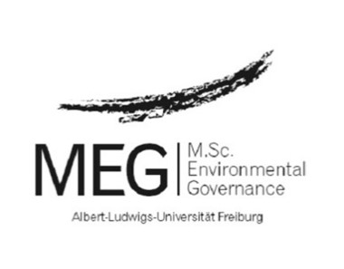

```{r setup, include=FALSE}
knitr::opts_chunk$set(echo = TRUE, message = FALSE, warning = FALSE,
tidy.opts=list(width.cutoff = 60))
library(units)

```

\allsectionsfont{\raggedright}

\setmainfont{Arial}

\pagenumbering{gobble}

\centering

\vspace{3 cm}

```{r uni logo, echo=F, out.width = '20%'}

```

\vspace{0.5 cm}

\normalsize
\singlespacing
Albert-Ludwig-University Freiburg 

Faculty of Environment and Natural Resources

\vspace{1 cm}

```{=tex}
\Large
\doublespacing
```
**Measuring What Matters: Towards A Comprehensive**

**Approach to Measuring Students‘ Sustainability**

**Competencies by Integrating Efficacy Beliefs**

\vspace{0.7 cm}

```{=tex}
\normalsize
\singlespacing
```
Master-thesis submitted in partial fulfilment of the requirements for the degree of 

Master of Science Environmental Governance

\vspace{0.5 cm}

by

\vspace{0.5 cm}

\Large

**Daniela Naveena Gargya**

\normalsize

5107568

\vspace{0.3 cm}

```{r MEG logo, echo=F, out.width = '20%'}

```

\vspace{0.3 cm}

\normalsize

First supervisor: Prof. Dr. Astrid Carrapatoso, Pädagogische Hochschule Freiburg 

Second supervisor: Prof. Dr. Uwe Schmidt, Albert-Ludwigs-Universität Freiburg

\vspace{0.3 cm}
\singlespacing
Freiburg i.Br. / Germany

Date of submission: 02. August 2024

\justify

\newpage

\pagenumbering{gobble}

\textbf{Summary}

\spacing{1.5}

The critical role of education, particularly Education for Sustainable Development (ESD), in addressing escalating environmental and social challenges is widely acknowledged. However, we lack long-term empirical data on how innovative ESD interventions, as a promising educational approach, influence the sustainability competencies of students over time. Despite calls for more comprehensive testing, research has predominantly focused on either traditional learning methods or has utilized inadequate experimental research designs. In this study, I quantify the impact of an innovative ESD intervention, specifically the KlimaRatSchule project, on students' sustainability competencies, measured as sustainability attitudes, behaviours, and efficacy beliefs at one school, by analysing 206 self-reported surveys across three measurement points. The analysis revealed that the treatment group (n=7) demonstrated higher sustainability competencies compared to the control group (n=42) one year post ESD intervention. Additionally, I emphasized the importance of considering efficacy beliefs as a valuable outcome of ESD interventions and as a notable indicator for measuring sustainability competencies. My findings highlight the complexity of measuring sustainability competencies that matter and support calls for analysing and enhancing innovative ESD intervention methods as an educational design that can contribute to fostering human agency.

\pagenumbering{roman}

\newpage

```{=tex}
\centering
\raggedright
\tableofcontents
\justify
```
\newpage

\section*{Acknowledgements}

I would like to thank Dr. Eva-Maria Waltner and Prof. Dr. Astrid Carrapatoso for their constructive and helpful supervision. From getting to know the project, finding the research scope, consultation about data collection and data analysis, I always found open ears and reassuring plan Bs. I would also like to thank Fabia Spörckmann and Prof. Dr. Uwe Schmidt for the second supervision, their interest in the project and the uncomplicated and easy communication.

I also want to thank Rolf and Anette from Solare Zukunft e.V. for giving information on the project and providing the contact information to the schools. At the Angell School, I would like to thank the teaching staff for their support in collecting the data. 

Also, I want to thank my parents and friends for constant support and proofreading the draft.


\newpage

\section*{List of abbreviations}

ESD Education for sustainable development

KRS KlimaRatSchule

MP Measurement point

PBC Perceived behavioural control

RQ Research question

SA Sustainability attitudes

SB Sustainability behaviours

SC Sustainability competencies

TPB Theory of planned behaviour


\newpage

\pagenumbering{gobble}

\pagenumbering{arabic} 
```{r child = 'MA_introduction.Rmd'}
```

\newpage

```{r child = 'MA_methods.Rmd'}
```

\newpage

```{r child = 'MA_results.Rmd'}
```

\newpage 

```{r child = 'MA_discussion.Rmd'}
```

\newpage 

```{r child = 'MA_conclusions.Rmd'}
```

\newpage 

```{r child = 'MA_references.Rmd'}
```

\newpage 

```{r child = 'MA_appendix.Rmd'}
```

\newpage
\section*{Declaration of submission of the Master thesis}

I hereby declare that I have written the submitted Master thesis independently, have not used any sources and aids other than those specified and have labelled all content taken from other works as such. The Master thesis submitted is not or was not the subject of another examination procedure, neither in its entirety nor in significant parts.


\vspace{3 cm}

```{=tex}
\hrule
```

\vspace{1 cm}

Place, date / Signature
