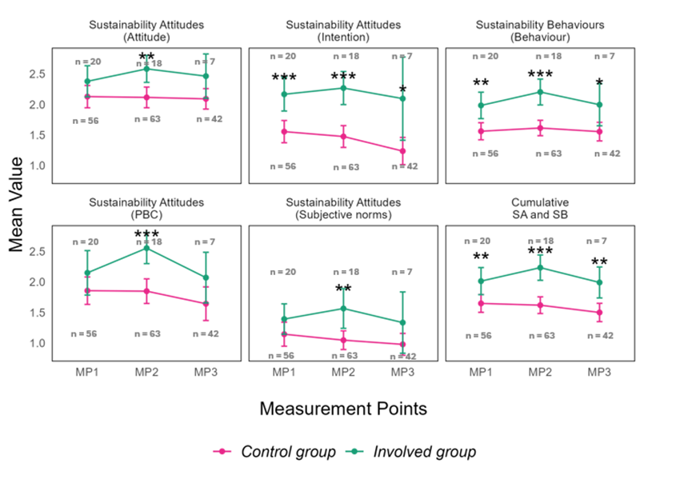
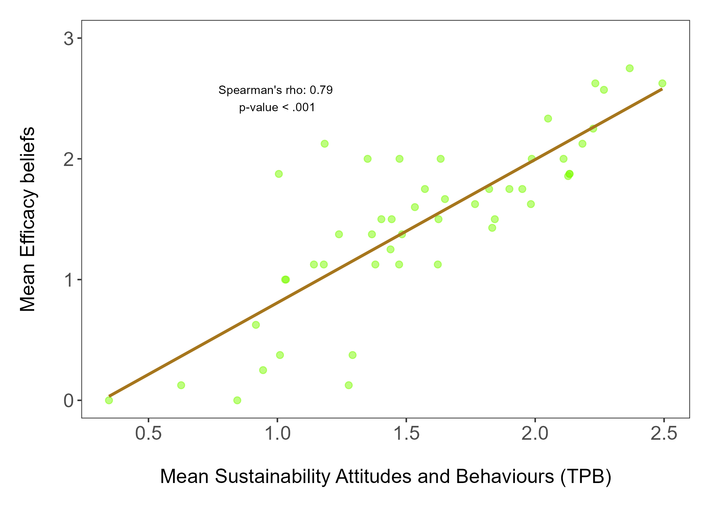
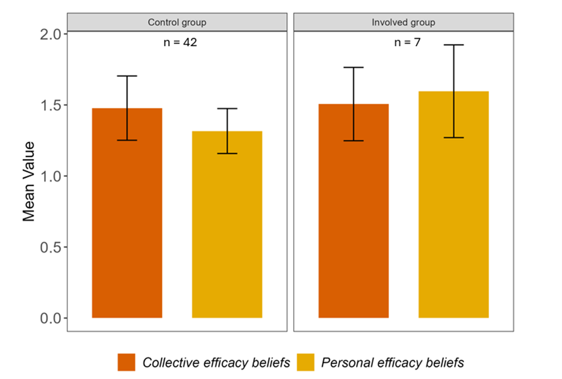
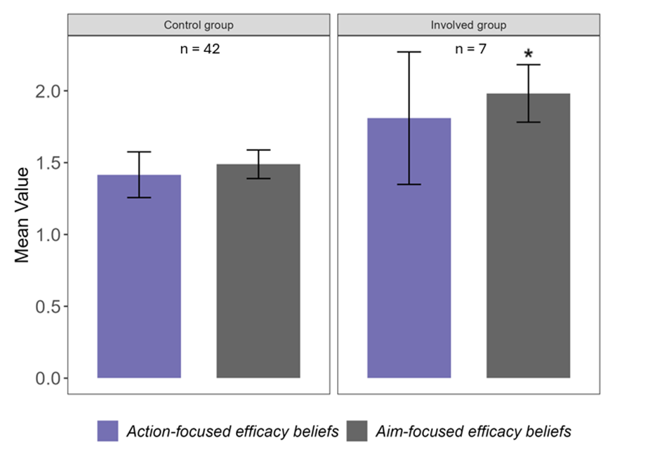

# Results

## Sustainability competencies as sustainability attitudes and sustainability behaviours (Research Question 1)

Contrary to my prediction, I found that one year post ESD intervention, sustainability attitudes and sustainability behaviours did not increase for either the involved or the control group (Figure 2, Table 9) across the 206 surveys. In line with my predictions, I found that the involved group (n=7) reported (some) statistically higher sustainability attitudes and behaviours (cumulative SA/SB and SB) than the control group one year post intervention (Figure 2, Table 10). The involved group reported higher mean scores than the control group for all sustainability competencies at all measurement points. Pre-intervention and one year post-intervention, the reported behaviour, intention and cumulative TPB scores differed significantly between the groups (Table 10). Surprisingly, for the involved group, all reported sustainability competencies peaked immediately post-intervention (MP2) but decreased again one year after the intervention (MP3) (Figure 2).

```{r RQ1, echo=F, fig.cap="\\label{fig:fig1} The components of sustainability competencies differed between the groups of 206  students surveyed using the Wilcoxon test for significance (Table 10). Points represent calculated means from self-reported surveys. Error bars indicate 95% confidence intervals. Data labels n indicate sample size. Stars indicate the level of significance obtained from the Wilcoxon signed rank test comparing the groups. See Table 4 for the meaning of the number of stars. No significant differences were found between the measurement points using the Kruskal-Wallis test (Table 9).",out.width = '100%',fig.show='hold',fig.pos="H", fig.align='center'}


```


## Sustainability attitudes/ sustainability behaviours and efficacy beliefs (Research Question 2)

  I found a strong positive relationship between the scales of sustainability attitudes and sustainability behaviours operationalised with the Theory of planned behaviour and the scales operationalised with the construct of efficacy beliefs (r (47) = .79, p < .001, Figure 3). 

```{r RQ2, echo=F, fig.cap="\\label{fig:fig1} The (TPB-based) Sustainability Attitudes/ Sustainabilitiy Behaviours scales and the (Triple-A-based) Efficacy Beliefs scales capture the same underlying construct and show a strong positive relationship among the 49 students surveyed, tested with Spearman's rank correlation. Points represent raw data. The line represents the calculated Spearman's rank correlation.",out.width = '80%',fig.show='hold',fig.pos="H", fig.align='center'}

```


## Sustainability competencies as efficacy beliefs (Research Question 3)

### Personal and collective efficacy beliefs

Contrary to my predictions, I found no statistical differences between personal (W = 88.5, p > .05, see Table 12) and collective (W= 123, p > .05,  see Table 12) efficacy beliefs between the involved and the control group among the 49 students surveyed at measurement point 3 (Figure 4). I found no differences between the collective and personal efficacy beliefs within the involved group (W = 0, p > .05, see Table 11) or within the control group (W = 1, p > .05, see Table 11).


```{r RQ3a, echo=F, fig.cap="\\label{fig:fig1} Reported personal and collective efficacy beliefs were not significantly different within and between the involved and control groups (see Tables 11 and 12) using the Wilcoxon sign ranked test at measurement point 3. Bars represent calculated means from the self-report survey. Error bars indicate 95% confidence intervals. Data labels n indicate sample size.",out.width = '90%',fig.show='hold',fig.pos="H", fig.align='center'}

```

### Aim- and action-focussed efficacy beliefs

In line with my predictions, I found that the involved group reported significantly higher scores for aim-focussed efficacy beliefs than the control group (W = 8, p < .05, see Table 14) among the 49 students surveyed at measurement point 3 (Figure 5). Although the involved group also scored higher on the action-focussed efficacy beliefs, there were no statistical differences (W = 1, p > .05, see Table 13). I found no differences between the action and aim-focussed scores for within the involved group (W = 1, p > .05, see Table 13) or within the control group (W = 1, p > .05, see Table 13).

```{r RQ3b, echo=F, fig.cap="\\label{fig:fig1} The aim-focused aspect of efficacy beliefs was significantly higher for the involved group than the control group across the 49 students surveyed using the Wilcoxon signed rank test at measurement point 3 (Table 14). The action-focused efficacy beliefs and the within-group comparisons were not significantly different (Tables 13 and 14). Bars represent calculated means from the self-report survey. Error bars indicate 95% confidence intervals. Data labels n indicate sample size. Stars indicate the level of significance obtained from the Wilcoxon signed rank test comparing the groups. See Table 4 for the meaning of the number of stars.",out.width = '90%',fig.show='hold',fig.pos="H", fig.align='center'}

```